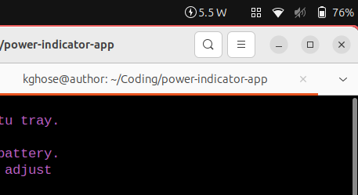

# Battery power panel indicator 

This is a very simple [Application Panel Indicator][1]. It shows the current
battery power drain by doing `cat /sys/class/power_supply/BAT0/power_now`
periodically and using that as the text of the indicator. It is based on
[this example][2].

Copy the indicator app (`battery-rate.py`) somewhere (e.g. "`/my/path`") and 
copy the desktop file (`power-indicator.desktop`) to 
`~/.local/share/applications` after changing the `Exec` entry to whatever 
"`/my/path`" is. [See this for details][3].

You will need `appindicator` installed e.g. `sudo apt-get install 
gir1.2-appindicator3-0.1`. In Ubuntu this is enough to get things going.

## Special instructions for openSUSE TumbleWeed

openSUSE is special.
1. `sudo zypper install typelib-1_0-AppIndicator3-0_1`
2. Install and enable the GNOME shell extension [AppIndicator and 
   KStatusNotifierItem Support][4]

[1]: https://wiki.ubuntu.com/DesktopExperienceTeam/ApplicationIndicators`
[2]: https://askubuntu.com/a/820858
[3]: https://unix.stackexchange.com/a/103222
[4]: https://extensions.gnome.org/extension/615/appindicator-support/
